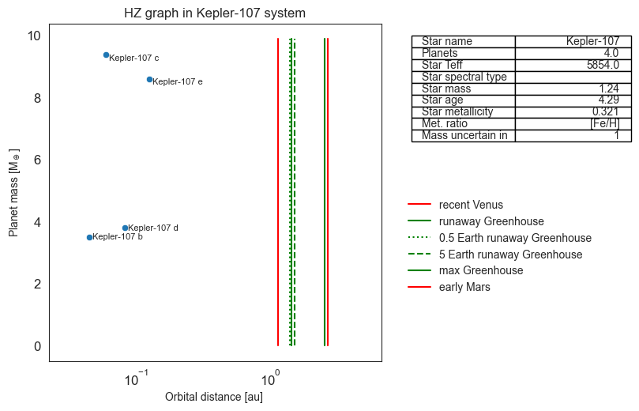
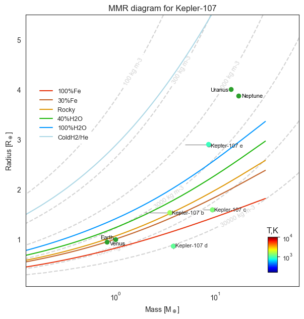

# Exoplanets system architecture

## Preparing the sample

For retrieving information from working databases initially we need a list of potentially interesting systems, which can be formed by following script: `systems-min2planets-withMassSinAndRadius.py`.

This script allows to retrieve star names for the systems, where at least two planets have both mass and radius defined, by fetching parameter `star_name` from Exoplanet.eu database.

``` sh
$ python ./systems-min2planets-withMassSinAndRadius.py
```

You could run this script in the terminal. It will write in the `systems-min2planets-withMassSinAndRadius.txt` file, which could be edited manually, if you already knew what system you want to exclude. It will save some processing time.

For retrieving the whole information about the system in interest, you can run `task-manager.sh` which will work through the planetary system list in `systems-min2planets-withMassSinAndRadius.txt` , using script `one-system_rewrite_star.py` and write one `.pkl` file for each system in the designated folder, in this case `./data`

``` sh
$ ./task-manager.sh
```

At this stage you could visualise systems, and for that you would need data of solar system planets. The shell script you can run, `task-manager-charts.sh`, will load it from the folder `./data/solarsystem.pkl` and the interior curves data file `curves.txt` (Zeng et al, 2019).

``` sh
$ ./task-manager-charts.sh
```

This script will work through the planetary systems files  `"system name".pkl` in the folder `./data/systems_for_chart/` using the other script `one-system-charts_hz.py`, and making figures for Habitable zone edges [1] and mass-radius diagrams [2] for every individual planetary system. There are the examples for Kepler-107 system:





The HZ edges are calculated according to Kopparapu et al., 2014.

In order to further investigate the data you need to concatenate all chosen system files to one, with which the certain jupyter notebooks will work, also this combined file in `.pkl` form will be needed to create working files for internal systems structure analyses. You can do the concatenation by running the script `merg-edges.py`, but you need to put all needed system's `.pkl` in the folder `./merg` first. The script creates file `all_my_systems.pkl`.

``` python
$ python ./merg-edges.py
```

In aforementioned folders: `./data`, `./data/systems_for_chart/`, `./merg` I put example planetary system .pkl files for checking how the scripts work. After doing the routine from the start, you will obtain such files of the new systems that meet your selection criteria. You can aso make your own file tree for your convenience, but do not forget to change paths if you do.

## Analyses of the sample

### System architecture: masses, radii similarities

For analysing "peas in the pod" tendency among masses and radii of adjacent planets in the system, you can create a new `.pkl` file from existing sample file `all_my_systems.pkl` by using `pairs_MRP_stellar.py`, which you can run in the terminal.

`python ./pairs_MRP_stellar.py`

It will write a new file `MRP_data_sets.pkl` in the `data` folder. The file consists now paired data for two adjacent planets in the system as one row in the pandas data frame.

For bulk analyses of similarity in masses or radii of adjacent planets depend on stellar parameters you can use the following scripts: for masses `mass_systems_chunks_charts.py`, similarly for radii `radius_systems_chunks_charts.py`. These scripts will create designated folders in the working folder, where they will store plots and `.pkl` files for planets pairs divided in chunks by stellar parameters. For example, planets with specified host star effective temperature will be in 3 separated groups: less 4200 K, between 4200 and 5500 K, more than 5500 K. By editing the scripts, you can choose mass/radius precision by trimming the data, for example 0.3 will represent 30% error allowed, and the borders of the groups, for example: low metallicity as less than -0.09, solar metallicity between -0.09.

For analysing periods ratio and dynamical stability of adjacent planets in the system, you can create a new `.pkl` file from existing sample file `all_my_systems.pkl` by using `triples_MRPD.py`, which you can run in the terminal.

``` sh
$ python ./triples_MRPD.py
```

It will write a new file `triples_MR.pkl` in the `data` folder. The file consists now data for three adjacent planets in the system as one row in the pandas data frame.


References:

Kopparapu, R. K., Ramirez, R. M., SchottelKotte, J., Kasting, J. F., Domagal-Goldman,
S. and Eymet, V. (2014). ‘Habitable zones around main-sequence stars: dependence
on planetary mass’. In: The Astrophysical Journal Letters vol. 787, no. 2, p. L29.

Zeng, L., Jacobsen, S. B., Sasselov, D. D., Petaev, M. I., Vanderburg, A., Lopez-Morales,
M., Perez-Mercader, J., Mattsson, T. R., Li, G., Heising, M. Z. et al. (2019). ‘Growth model interpretation of planet size distribution’. In: Proceedings of the National Academy of Sciences vol. 116, no. 20, pp. 9723–9728.
